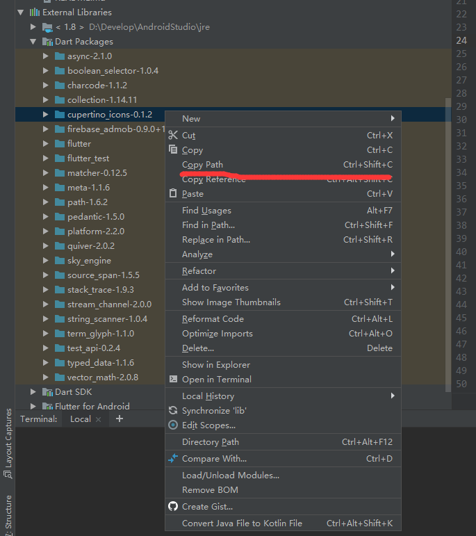
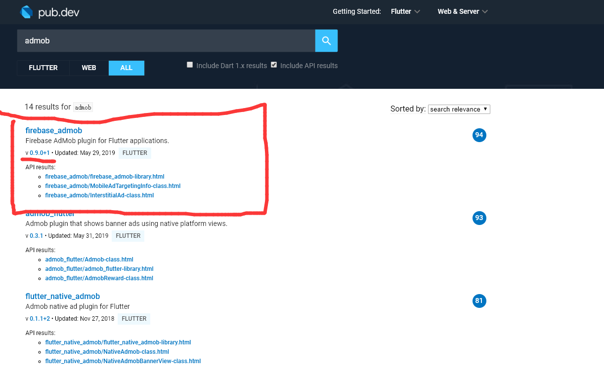

# Flutter引入Google Admob
目录：
1. [注册admob](#register)
2. [添加Flutter firebase_admob依赖](#dependencies)
3. [配置Admob](#xml)
4. [应用中注册广告实例](#instance)

<span id='register'/>

## 1. [注册admob|需要梯子](https://apps.admob.com/)
- 获取到AppId以及广告单元Id
- 配置付款信息

<span id='dependencies'/>

## 2. 添加Flutter firebase_admob依赖
- 需要在pubspec.yaml中，在dependencies中添加firebase_admob，
- 版本状态可[在pub.dev中查看](https://pub.dartlang.org/)，此处使用^0.9.0+1
- 在项目根目录下，命令行执行 `flutter pub get`，进行库文件的下载
    - 失败的可能性：
        1. 需要翻墙 
        2. 下载文件有缺漏，导致后面使用缺漏的文件，需要找到Dart Packages的目录(以AndroidStudio为例)，找到包目录，将有异常的包删除后重新获取

        

```yaml
dependencies:
  firebase_admob: ^0.9.0+1
```



<span id='xml'/>

## 3. 配置Admob
[Flutter包管理中的firebase_admob网址](https://pub.dev/packages/firebase_admob)
### 3.1 安卓配置
- 需要在`android/app/main/AndroidManifest.xml`中引入GoogleAdmob

```xml
<manifest xmlns:android="http://schemas.android.com/apk/res/android"
    package="com.example.flutter_app">
    <!-- 其他配置 -->

    <!-- 需要注意，该meta-data必须为manifest的子标签，位置嵌套错时会导致报错 -->
    <meta-data
        android:name="com.google.android.gms.ads.APPLICATION_ID"
        android:value="[AppId]"/>

</manifest>
```

### 3.2 IOS配置
- 需要在`ios\Runner\Info.plist`中引入GoogleAdmob

```xml
<?xml version="1.0" encoding="UTF-8"?>
<!DOCTYPE plist PUBLIC "-//Apple//DTD PLIST 1.0//EN" "http://www.apple.com/DTDs/PropertyList-1.0.dtd">
<plist version="1.0">
<dict>
    <key>GADApplicationIdentifier</key>
    <string>[AppId]</string>
    <!-- 其他配置 -->
</dict>
</plist>
```

<span id='instance'/>

### 4.应用中注册广告实例
1. [新建Ads.dart](./codes/Ads.dart)，封装一些广告变量以及函数,`例子中的广告id使用的是google提供的测试id，实际上线时，需要换成自己的`
2. 需要引入广告页面中引入 Ads.dart文件，调用函数进行广告加载，[此处以main.dart为例，11~15行](./codes/main.dart)
3. [查看firebase_admob官方包使用示例](https://pub.dev/packages/firebase_admob)